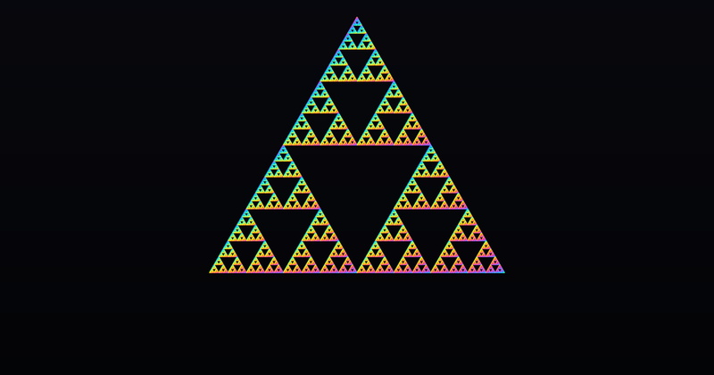
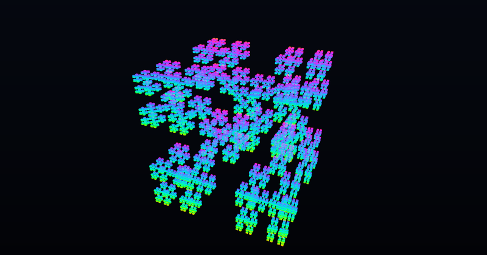
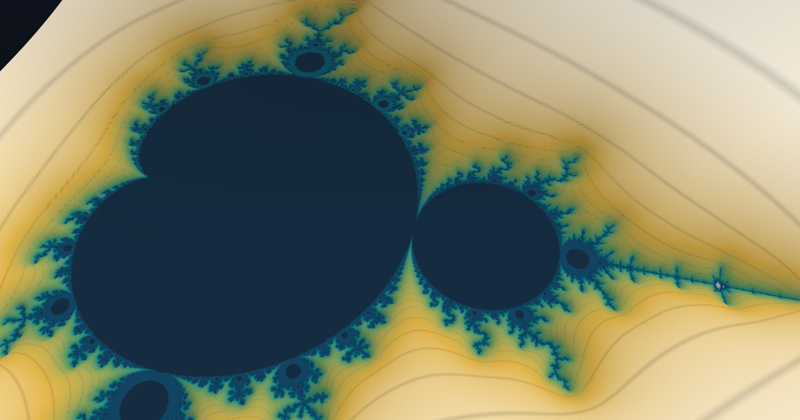
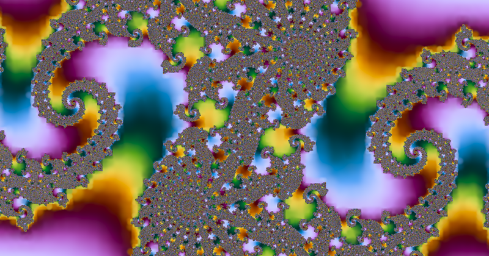

# Fractal Splats

Fractals rendered as Gaussian splats, refined on demand as the camera descends.
One HTML file, WebGL 2, no dependencies.

Dr. Marcel Padilla, ETH Zürich &nbsp;·&nbsp; **[Open the live demo](https://marcelpadilla.github.io/Projects/Fractal_Splats/)**

<p align="center">
  
</p>

<p align="center"><sub>The folded dragon, magnified fourfold and then repeating exactly.</sub></p>

<p align="center">
  
  
  
  
</p>

<p align="center"><sub>Sierpinski triangle, Cantor cube, Mandelbrot terrain, Julia set. Fourteen objects ship in the viewer.</sub></p>

## Method

Gaussian splatting is normally an inverse problem: primitives are fitted to photographs. This is
the forward case. The primitives come from the fractal's own definition, and nothing is scanned,
fitted or trained.

It rests on one fact. A Gaussian pushed through an affine map is exactly a Gaussian,

```
w(x) = A x + b        =>        w * N(mu, S) = N(A mu + b, A S A^T)
```

so an affine iterated function system is already its own infinite level of detail hierarchy, and it
costs nothing to build because it is never built. Each frame chooses a ragged front through that
hierarchy, splitting a node when its projected footprint exceeds a pixel threshold, and draws a
parent alongside its children across a band so that a split is a dissolve rather than a
substitution. The dissolve conserves the drawn weight exactly, which is only possible because the
subdivision is exact.

Descending is then limited by floating point rather than by detail, and that limit is removed as
well: the scene is periodically re-expressed in the coordinates of the piece the camera is inside,
which turns a descent into a loop in which no number ever grows. Measured, the position error is
flat at 2.4e-11 pixels at a zoom of 10^2084, against walls at 10^4 and 10^12.8 for float32 and
float64 in one global frame.

The same refinement drives two escape time objects: a distance estimated terrain over the
Mandelbrot set, whose height is the distance estimate itself so that the relief is invariant under
zoom, and the escape time field drawn flat, one Gaussian per quadtree cell coloured by the smooth
escape count.

## Running

Open `index.html` in a browser with WebGL 2. Nothing is fetched after load and there is nothing to
install.

Every view is a deep link. The query string carries the object, the camera and every rendering
parameter, so any frame can be reproduced exactly.

## Building

```
node build.mjs           # concatenates src/*.js and writes index.html
node test_headless.mjs   # the checks that need no GPU
```

The sources share one scope deliberately: the refinement kernel reads flat typed arrays out of the
enclosing scope, and a module boundary would put a property load in the inner loop. They are
numbered by layer, ten apart.

The tests check the invariant measure against its closed form, the kernel normalisation, the
refinement cut, the Mandelbrot field, rebasing, and a full descent driven through the real camera
loop.

## Performance

Headless Chrome through ANGLE D3D11 on an RTX 4090, drawing buffer 1896 by 981, camera still and
the cut converged:

| object | splats | frame |
| --- | --- | --- |
| Sierpinski tetrahedron | 320 000 | 19.1 ms |
| Cantor cube | 268 000 | 19.5 ms |
| Folded dragon | 166 000 | 20.1 ms |
| Mandelbrot set, in the plane | 70 100 | 31.7 ms |

The splat counts are deterministic. The frame times are measured under a virtual clock and are
indicative rather than wall clock.

## Citation

```bibtex
@software{padilla2026fractalsplats,
  author  = {Padilla, Marcel},
  title   = {Fractal Splats: adaptive Gaussian splatting of self similar sets},
  year    = {2026},
  month   = {8},
  url     = {https://marcelpadilla.github.io/Projects/Fractal_Splats/},
  note    = {Interactive WebGL 2 demo}
}
```

## License

MIT, see [LICENSE](LICENSE). Written from scratch, with no third party code.
