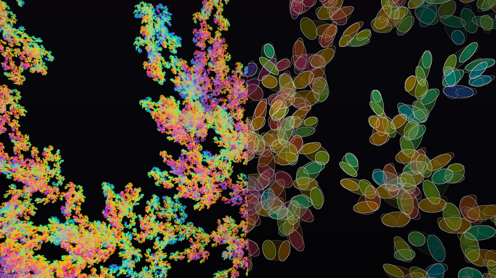

# Real-Time Fractal Splats

An experiment on using Gaussian splats to show fractals. Self similarity is used to create its own
level of detail hierarchy efficiently while avoiding pixel based computations. Provided by Dr. Marcel Padilla. A live demo can be found on the project page.

  

  <em>Gaussian splat rendering of the folded dragon.</em>

The code runs in a single html inside your browser.