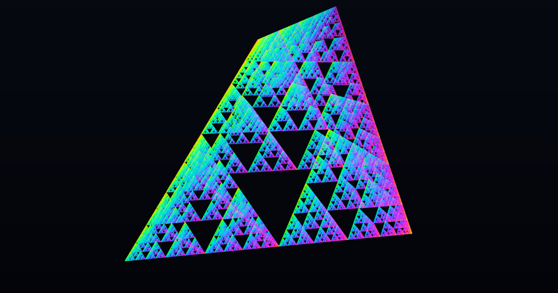
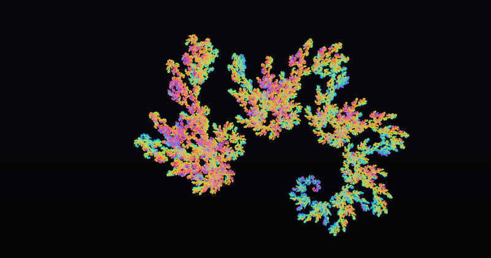

# Fractal Splats

Fractals rendered as Gaussian splats, refined on demand as the camera descends.
By [Marcel Padilla](https://marcelpadilla.github.io/), ETH Zürich.

**[Open the live demo](https://marcelpadilla.github.io/Projects/Fractal_Splats/)**

<p align="center">
  
</p>

<p align="center">
  
  
  
</p>

<p align="center"><em>Cantor cube, Sierpinski tetrahedron, folded dragon. The zoom above magnifies
the Sierpinski carpet nine times and then repeats exactly, so it is a genuine loop rather than a
clip that restarts. It is also available as <a href="media/carpet_zoom.mp4">MP4</a>, which is
sharper and smoother than the GIF.</em></p>

## What it is

An experiment on using Gaussian splats to show fractals. Self similarity is used to create its own
level of detail hierarchy efficiently while avoiding pixel based computations.

## Running it

`index.html` is the whole thing. Open it in a browser. There is nothing to build, nothing to
install and nothing is fetched after load: one HTML file of about 495 kB, WebGL 2, no libraries and
no data files.

Every view is a deep link, so a picture can be reproduced exactly by its query string.

## Citation

```bibtex
@software{padilla2026fractalsplats,
  author  = {Padilla, Marcel},
  title   = {Fractal Splats: adaptive Gaussian splatting of self similar sets},
  year    = {2026},
  month   = {8},
  url     = {https://marcelpadilla.github.io/Projects/Fractal_Splats/},
  note    = {Interactive WebGL 2 demo}
}
```

## License

MIT, see [LICENSE](LICENSE). The viewer is written from scratch and contains no third party code.
