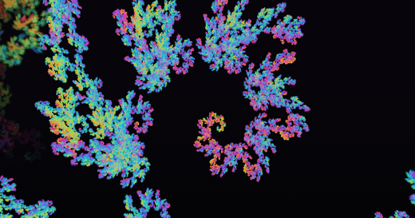
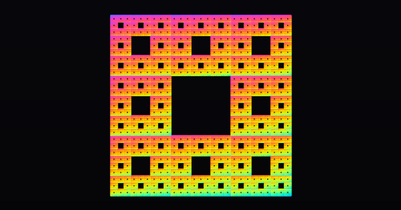

# Fractal Splats

Fractals rendered as Gaussian splats, refined on demand as the camera descends.

**[Open the live demo](https://marcelpadilla.github.io/Projects/Fractal_Splats/)**

<p align="center">
  
</p>

<p align="center">
  
  
  
</p>

<p align="center"><em>Cantor cube, Sierpinski tetrahedron, Sierpinski carpet. The zoom above is also
available as <a href="media/dragon_zoom.mp4">MP4</a>, which is smaller and much better encoded than
the GIF.</em></p>

## What it is

A self similar set is its own level of detail hierarchy. A piece of the object is an exact affine
copy of the whole, so the recursion that defines the fractal is also the tree the renderer walks,
and the scene can be re-expressed in a piece's own coordinates at any moment. Nothing in the
renderer ever becomes a very large or a very small number, so the zoom has no precision wall and
simply continues.

Each piece is drawn as one anisotropic Gaussian rather than as points or triangles. The splat is
computed in closed form from the piece's own map, never sampled and never fitted, and it is
refined or retired according to how large it is on screen. The escape time sets, which are not
self similar, are drawn instead as an adaptive quadtree of Gaussians over the field.

Fifteen objects in three groups: self similar sets in 3D, self similar sets in 2D, and the
Mandelbrot and Julia sets with a per pixel reference render to compare against.

## Running it

`index.html` is the whole thing. Open it in a browser. There is nothing to build, nothing to
install and nothing is fetched after load: one HTML file of about 480 kB, WebGL 2, no libraries and
no data files.

Every view is a deep link, so a picture can be reproduced exactly by its query string.

## Citation

```bibtex
@software{padilla2026fractalsplats,
  author  = {Padilla, Marcel},
  title   = {Fractal Splats: adaptive Gaussian splatting of self similar sets},
  year    = {2026},
  month   = {8},
  url     = {https://marcelpadilla.github.io/Projects/Fractal_Splats/},
  note    = {Interactive WebGL 2 demo}
}
```

## License

MIT, see [LICENSE](LICENSE). The viewer is written from scratch and contains no third party code.
